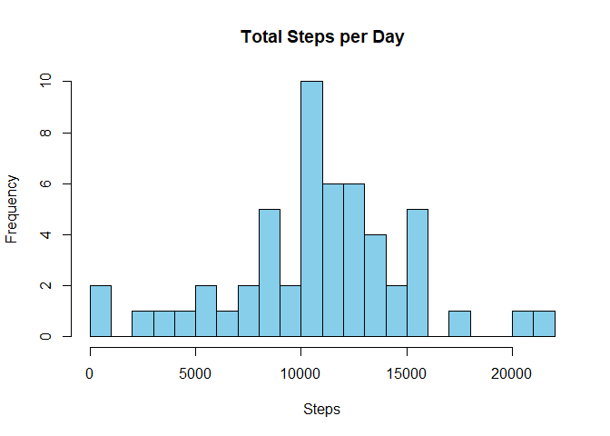
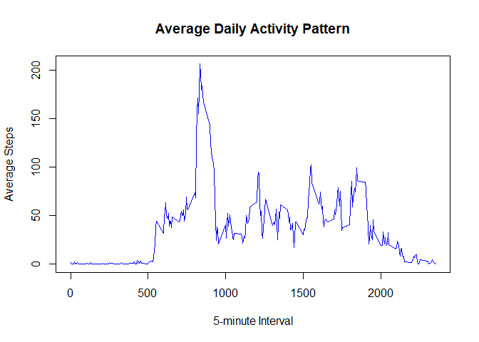
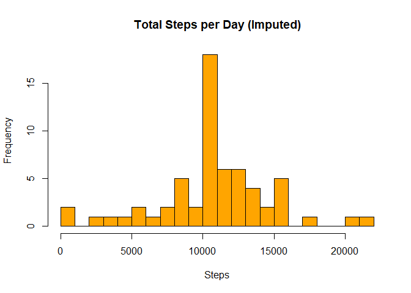
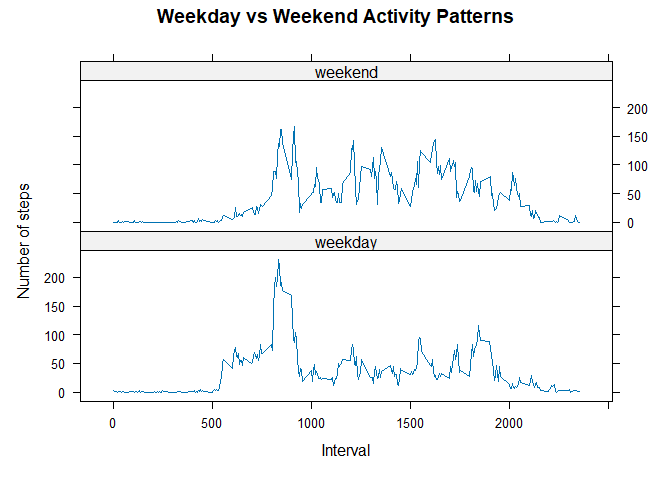

``` r
# Load required libraries
library(ggplot2)
library(lattice)

# Load dataset (adjust path if needed)
activity <- read.csv("C:/Users/Benjamin/Desktop/RepData_PeerAssessment1/activity.csv")

# Convert date column
activity$date <- as.Date(activity$date, format="%Y-%m-%d")

# -----------------------------
# 1. Total number of steps per day
# -----------------------------
steps_per_day <- aggregate(steps ~ date, data=activity, sum, na.rm=TRUE)

hist(steps_per_day$steps, main="Total Steps per Day", xlab="Steps", col="skyblue", breaks=20)
```

<!-- -->

``` r
mean_steps <- mean(steps_per_day$steps, na.rm=TRUE)
median_steps <- median(steps_per_day$steps, na.rm=TRUE)

cat("Mean steps per day (original data):", mean_steps, "\n")
```

```
## Mean steps per day (original data): 10766.19
```

``` r
cat("Median steps per day (original data):", median_steps, "\n")
```

```
## Median steps per day (original data): 10765
```

``` r
# -----------------------------
# 2. Average daily activity pattern
# -----------------------------
steps_per_interval <- aggregate(steps ~ interval, data=activity, mean, na.rm=TRUE)

plot(steps_per_interval$interval, steps_per_interval$steps, type="l",
     main="Average Daily Activity Pattern",
     xlab="5-minute Interval", ylab="Average Steps", col="blue")
```

<!-- -->

``` r
max_interval <- steps_per_interval[which.max(steps_per_interval$steps),]
cat("Interval with max average steps:", max_interval$interval, 
    "with", max_interval$steps, "steps\n")
```

```
## Interval with max average steps: 835 with 206.1698 steps
```

``` r
# -----------------------------
# 3. Imputing missing values
# -----------------------------
cat("Number of missing values:", sum(is.na(activity$steps)), "\n")
```

```
## Number of missing values: 2304
```

``` r
activity_imputed <- activity
for (i in 1:nrow(activity_imputed)) {
  if (is.na(activity_imputed$steps[i])) {
    interval_val <- activity_imputed$interval[i]
    mean_val <- steps_per_interval$steps[steps_per_interval$interval == interval_val]
    activity_imputed$steps[i] <- mean_val
  }
}

steps_per_day_imputed <- aggregate(steps ~ date, data=activity_imputed, sum)

hist(steps_per_day_imputed$steps, main="Total Steps per Day (Imputed)", 
     xlab="Steps", col="orange", breaks=20)
```

<!-- -->

``` r
mean_steps_imp <- mean(steps_per_day_imputed$steps)
median_steps_imp <- median(steps_per_day_imputed$steps)

cat("Mean steps per day (imputed data):", mean_steps_imp, "\n")
```

```
## Mean steps per day (imputed data): 10766.19
```

``` r
cat("Median steps per day (imputed data):", median_steps_imp, "\n")
```

```
## Median steps per day (imputed data): 10766.19
```

``` r
# -----------------------------
# 4. Weekday vs Weekend patterns
# -----------------------------
activity_imputed$day_type <- ifelse(weekdays(activity_imputed$date) %in% 
                                      c("Saturday","Sunday"), "weekend", "weekday")

steps_daytype <- aggregate(steps ~ interval + day_type, data=activity_imputed, mean)

xyplot(steps ~ interval | day_type, data=steps_daytype, type="l",
       layout=c(1,2), ylab="Number of steps", xlab="Interval",
       main="Weekday vs Weekend Activity Patterns")
```

<!-- -->
